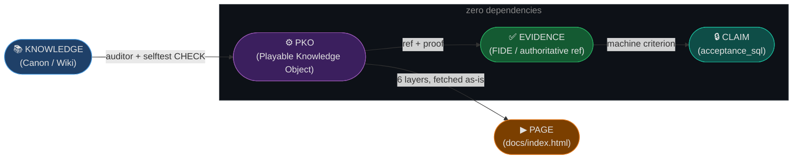

# almanac — knowledge that tells you when it has gone stale

[](https://github.com/Igor-Zinin/almanac/actions/workflows/selftest.yml)
[](LICENSE-CODE)
[](LICENSE)
[](https://igor-zinin.github.io/almanac/docs/)

> **Renamed 18 Aug 2026**, from `axioma-xks-codex`. The old address still redirects.
> The format did not change; what changed is what it is *for* — see the next section.

## What this is becoming: an annual almanac

**An almanac of verifiable claims.** Once a year: dated statements carrying a numeric
probability and a named source of resolution, scored when the term falls due. Signatories
are people and models in one table. Inside each issue sits **the envelope** — sealed, not
to be opened before its date, holding the bets for the coming year.

Two names, two layers. The **almanac** is the publication: it grows, accumulates, gets
bound. The **envelope** is the ritual object inside it: sealed, gifted, carrying wax.

**Nothing has been published yet.** No issue exists; no envelope has been sealed. The first
issue is due **December 2026**, and this line is here so that a missed December is visible
to anyone reading, not only to its author. That is the same discipline the format below
applies to knowledge: a claim states when it expires.

The specification, the observatory and the chess run in this repository are not the product.
They are the **language** the almanac is written in, the **front desk** where others submit,
and the **first run** that proved the desk works.

## The failure this is about

A knowledge base does not announce that it has gone out of date. Latency stays flat.
Retrieval still returns something. Faithfulness and context-recall still score well. The
system keeps answering fluently — right up to the moment it confidently states a policy that
changed months ago.

That failure is common and expensive. Across 143 enterprise RAG deployments, **73% hit a
critical failure in their first quarter of production, and 41% of those failures were not
caught by the standard evaluation suite**. Of the projects that die after a successful pilot,
**about 60% die on data freshness, not on retrieval quality**.

The reason it is hard to see is structural: a stale sentence and a true sentence are
byte-for-byte indistinguishable. Nothing about the text changes when the world moves
underneath it.

## What is here

Two things, and the second is the one worth your time.

**A format.** [Axioma-XKS](docs/AXIOMA-XKS.md) — a knowledge capsule that carries, in the same
file as the claim: who asserted it and when, a reference that resolves and a quote really
present at it, a declared confidence, an expiry with the trigger that would invalidate it, and
a criterion that runs and exits nonzero when the claim stops holding. None of that is novel
alone. The point is that it lives *in the capsule* and not in a wiki page beside it.

**A record of the format failing to save its own author.** Two published results retracted in
one day, an external review that called a section of the specification self-congratulatory —
published unedited, with its prompt — and six named gaps in the spec that are still open. If
you are evaluating whether any of this is real, start with
[what the format did *not* catch](docs/AXIOMA-XKS.md#what-this-format-did-not-catch-in-its-own-author)
and with [RESULTS.md](docs/RESULTS.md), where a retired benchmark and its withdrawn scores are
kept with the reasons attached.

Start here if you want the short version:
**[Silent staleness: five cases, and what actually caught each one](docs/SILENT-STALENESS.md)** —
five defects from this repository, why each was green at the time, and the four cheap
detectors that would have found them. No adoption required.

Nothing here asks you to adopt the format to get value from it.

## What the record is evidence *of*

The retractions are not confessions attached to the interesting part. They are the interesting
part, and they are collected deliberately, because together they answer a question this project
cares about more than any benchmark score: **when a verdict about a claim is wrong, what was it
that noticed?**

Every case in this repository has a named finder. Counted, the finders fall out like this:

| What was wrong | What actually caught it | Category |
|---|---|---|
| Benchmark key wrong in 6 of 12 fixtures | A second vendor's model disagreeing, twice | disagreement |
| Another vendor's model published at half its score | A person reading two files side by side | disagreement |
| A specification section flattering its author | An external reviewer with no stake in it | disagreement |
| A closed vocabulary silently lost in publication | A second corpus that could not use the format | disagreement |
| A specification stating one thing twice, contradicting itself | An agent inventorying the corpus with no expectation of it | disagreement |
| A citation stitched from three editions | A test that fetches the source and matches the quote | machine check |
| A quote that existed nowhere, in a capsule about capsules | The same test, after its coverage was widened past file one | machine check |
| One position recorded three ways | Investigating something else entirely | accident |

Five by disagreement, two by a machine check, one by accident. **Zero by careful reading**, and
zero by the capsule format itself. That distribution is the finding, and it is the reason this
repository publishes its failures with the finder attached rather than a leaderboard position:
a score tells you where a system landed, and tells you nothing about whether the judge was
right. These eight cases are a small dataset about the judge.

Two consequences follow, and both are load-bearing here:

**A control built by the party it checks confirms nothing.** The chess reference run scored a
clean 36/36 against a key that was wrong in half its fixtures, because the run and the key had
the same author. Agreement between a system and a gold set that share a parent is not evidence
of correctness; it is evidence of a shared assumption.

**A second reader outranks a better checklist.** Of the eight, the ones caught by disagreement
were caught by a party who did not share the author's assumptions — another vendor's model, a
cold reviewer, an agent with no prior reading of the file. Adding assertions to `selftest.mjs`
did not find any of the five; it now runs 78 of them, and none of them reads prose for
self-contradiction.

This is also why the specification's [known gaps](docs/AXIOMA-XKS.md#known-gaps) are printed
rather than filed. A gap a reader finds for themselves costs the author their credibility. A
gap the author printed first costs nothing and buys the only thing this corpus is actually
accumulating.

---



> **Core Principle: Every important CLAIM in this repository has an executable CHECK.**
> `CLAIM ──► CHECK ──► EXECUTION ──► RESULT ──► EVIDENCE`

---

## The format: Axioma-XKS

A PKO is one profile of **Axioma-XKS**, a capsule format for knowledge that can be audited:
every capsule carries its own claim, provenance, declared confidence, evidence, expiry, and a
machine-checkable criterion — in the same file, not in a wiki page beside it.

- **Specification:** [docs/AXIOMA-XKS.md](docs/AXIOMA-XKS.md)
- **Machine half:** [docs/data/axioma-xks-spine-v1.json](docs/data/axioma-xks-spine-v1.json) — validators and prompts read field names from here, never restate them
- **Conformance:** `node selftest.mjs` (check family `C-08`)

The specification includes an accurate account of four errors the format **did not** catch in
its own author's corpus, and what did. That section is the argument; the rest is mechanics.

## What is a PKO?

A **Playable Knowledge Object (PKO)** is the minimum unit of this factory.
One game rule → one PKO → six representations of the same knowledge:

| Layer | Purpose |
|---|---|
| `answer` | Human-readable explanation |
| `evidence` | Authoritative reference (FIDE rule, paper, etc.) |
| `model` | Formal preconditions and logic |
| `play` | Browser-interactive mini-scene — position, task, move validation, and success state |
| `quiz` | Questions to test understanding |
| `machine` | `local_check` — a command that runs and exits nonzero when the claim stops holding; `acceptance_sql` optional |

```bash
node selftest.mjs   # verifies structure, evidence, and runs every capsule's own criterion

# Chess v0.1 is RETIRED: six of its twelve fixtures had a wrong answer key.
# It is kept as a record of the error, not as something to run. See docs/RESULTS.md.
```

Zero runtime dependencies and no database is required for the public check. Network
is read-only for online evidence verification in C-06 (FIDE quote assertion), no
keys — just Node 18+. The optional `acceptance_sql` field records an external
observatory log; the public `local_check` is the reproducible source of truth.

---

## Quick start

```bash
git clone https://github.com/Igor-Zinin/almanac
cd almanac
node selftest.mjs
```

To read the object in a browser, serve the repo root and open `/docs/`
(the page loads the PKO with `fetch`, so `file://` will not work):

```bash
python -m http.server 8000    # then http://localhost:8000/docs/
```

---

## Monorepo layout

```
packages/
  auditor/         ← PKO structural auditor (from DaemonTycoon)

knowledge/
  pko/             ← PKO atoms: *.pko.json — the canon

docs/
  index.html       ← public page: all 6 layers of one PKO, no framework, no CDN
  style.css
  data/            ← byte-copy of knowledge/pko for GitHub Pages; drift is caught by C-05

scripts/
  sync-docs.mjs    ← refreshes docs/data/ from the canon

selftest.mjs       ← C-01…C-08: every claim has a check that runs
LICENSE            ← CC BY 4.0 — knowledge atoms, schemas, docs
LICENSE-CODE       ← MIT — code
```

`docs/data/` is a second copy of the same bytes, which is normally how a
repository starts lying to itself. Here it cannot: `selftest.mjs` (C-05) compares
it byte-for-byte with `knowledge/pko/` and goes red on any divergence. Run
`node scripts/sync-docs.mjs` after editing a PKO.

---

## The public page

[`docs/index.html`](docs/index.html) renders one PKO in full: claim, evidence with a
link to the FIDE source, formal model, and an interactive board position built from the `fen`
field, quiz with hidden answers, and the machine criterion. Nothing is retyped into
the HTML — every value is read from the `.pko.json` at runtime, and an empty field is
drawn as a dash rather than filled in with a guess.

Live: **https://igor-zinin.github.io/almanac/docs/**

---

## What is not here

- No external game engine is required for the first public object. The `play` layer is a
  browser-native interactive scene: select the white pawn, select a destination,
  receive feedback, and see the resulting position. A richer engine may be added later.
- No AI model — evidence must be authoritative (FIDE rules, papers, etc.).
- No XKS schema validator. The Python one imported in Phase B arrived byte-corrupted
  and was removed rather than left in place as a green-looking file that never parsed.
- No external users yet. Zero. The first fork that runs the selftest will be the first.

---

## P1: Chess vertical slice

First game PKO atom: [`knowledge/pko/chess-en-passant-001.pko.json`](knowledge/pko/chess-en-passant-001.pko.json)

**Claim:** En passant is a special pawn capture valid only on the turn immediately after an opponent's double pawn advance.
**Evidence:** FIDE Laws of Chess 2023, Article 3.7(d).
**Status:** All 6 layers complete. selftest GREEN.
**Readable form:** [`docs/index.html`](docs/index.html) — the same object for a human, rendered from the same JSON.

The public evaluation layer is the [Game Codex Observatory](docs/OBSERVATORY.md):
[Chess Benchmark v0.1](docs/CHESS-BENCHMARK-V0.1.md) defines the first capability
profile, and [governance](docs/OBSERVATORY-GOVERNANCE.md) defines how results move
from submitted to reproduced to verified.

---

## Where we stand

A benchmark claim published without naming the neighbors who already measure the
same territory does not survive review. This is not courtesy — it is how the
factory's own doctrine ("lean on shoulders, do not cut down") applies to itself:
we are not competing with the projects below, we are sitting on top of what they
already built.

| Project | What it measures | How we differ |
|---|---|---|
| [LMGame-Bench](https://arxiv.org/abs/2505.15146) ([code](https://github.com/lmgame-org/GamingAgent)) — ICLR 2026 | Perception and planning across six games (Sokoban, Tetris, Candy Crush, 2048, Super Mario Bros, Ace Attorney) via a modular harness; 13 models evaluated. | They run live agents against six real games today; we have one browser-interactive PKO and zero model runs. Where they are ahead, they are simply ahead. |
| [BALROG](https://arxiv.org/abs/2411.13543) — ICLR 2025, [balrogai.com](https://balrogai.com) | Agentic LLM/VLM reasoning in long-horizon, procedurally generated environments (NetHack and others), with a live, weekly-updated leaderboard. | They have a running leaderboard and verified submissions; we have no agent execution and no leaderboard at all. |
| [TextArena](https://arxiv.org/abs/2504.11442), [textarena.ai](https://www.textarena.ai/) | 70+ text games, live play against humans and models, real-time TrueSkill ratings. | They measure live play at scale; our first object is a small browser scene, not yet a model benchmark. Pure breadth and scale loss on our side. |
| [Kaggle Game Arena](https://www.kaggle.com/game-arena) | Head-to-head model tournaments (chess now, Go/poker planned), all-play-all format, Google-run infrastructure. | Different genre entirely — a tournament platform, not a knowledge repository. We have no comparable infrastructure and are not building one. |
| [ChessQA](https://arxiv.org/abs/2510.23948) | LLM chess understanding across five categories: structural rules, motifs, tactics, position judgment, semantics. | Same domain (chess), opposite grain: they cover breadth of chess knowledge with many questions per model; we cover one rule (en passant) to full depth — six representations, one machine-checkable criterion, one proof. |
| [GVGAI-LLM](https://arxiv.org/abs/2508.08501) | Procedurally-infinite arcade games via ASCII rendering; spatial reasoning and planning across nine LLMs. | They have a full game-environment scoring engine; our first `play` layer is a focused browser scene, not yet a general game engine. |

**What we actually have, stated plainly:** one public interactive PKO, a
deterministic Chess v0.1 reference result, and zero provider-backed model runs.
Minesweeper and Connect Four are plan, not inventory — they do not exist in this
repo yet.

**Our one thesis:** every project above publishes a score as of today. We publish
a decay curve per claim, with a proof and a death date attached to each one. Our
unit of measurement is a checkable claim, not a game.

**Why this shelf exists at all — saturation.** A 2026 study of 60 widely-cited
LLM benchmarks found 29 already highly saturated (Sindex ≥ 0.7), 14 of those very
highly saturated (≥ 0.9) — [arXiv:2602.16763](https://arxiv.org/abs/2602.16763).
BIG-Bench Hard is the canonical case: assembled in 2022 specifically from tasks
that were *hard* for language models at the time
([arXiv:2210.09261](https://arxiv.org/abs/2210.09261)), and by 2024–2026 frontier
models clear it above 90%, leaving it useful mostly for mid-tier and open-weight
comparison. A score frozen on a leaderboard has no way to say when it stopped
being a good question — a decay-dated claim does.

---

## Donors (Phase A Forensic Merge Map)

This repo grew out of 4 private repos. The full asset-by-asset classification
(ADOPT / EXTRACT / ADAPT / ARCHIVE / REJECT) is not published.

Only what is actually in the tree is listed as taken — everything else is still
sitting in the donors:

| Donor | Role | Taken so far |
|---|---|---|
| `DaemonTycoon` | Factory OS | Auditor engine (`packages/auditor`) — reworked, Firebase/Telegram dependency stripped |
| `knowledge-matrix-contour` | Canon Source | XKS ideas: layer set, provenance and decay stamps |
| `Game` | Public Shell | nothing yet |
| `HeartStone-2` | Simulation | nothing yet |

---

## License

The repository is mixed, so there are two licenses — pick the one matching what you take.

| What | License | File |
|---|---|---|
| **Code**: `selftest.mjs`, `packages/**`, `scripts`, build glue | **MIT** | [`LICENSE-CODE`](LICENSE-CODE) |
| **Knowledge and texts**: `knowledge/**` PKO atoms, schemas, README | **CC BY 4.0** | [`LICENSE`](LICENSE) |

Third-party material keeps its own terms. Authoritative references cited in the
`evidence` layer of a PKO (FIDE Laws of Chess, papers) belong to their rights
holders and are cited, not redistributed.
